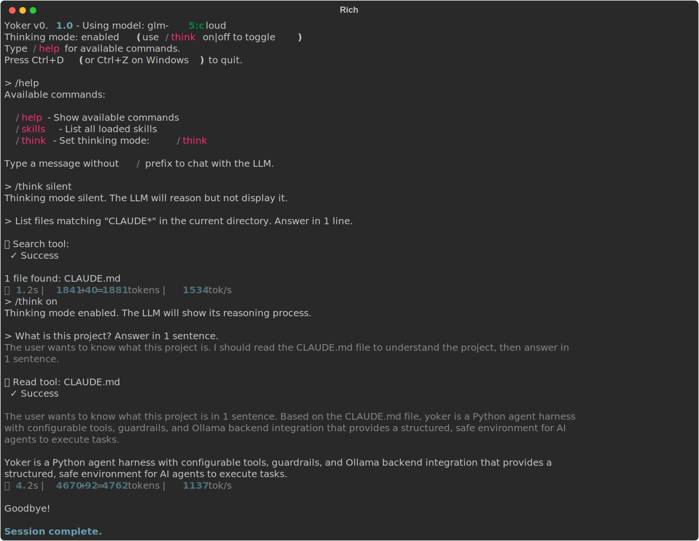
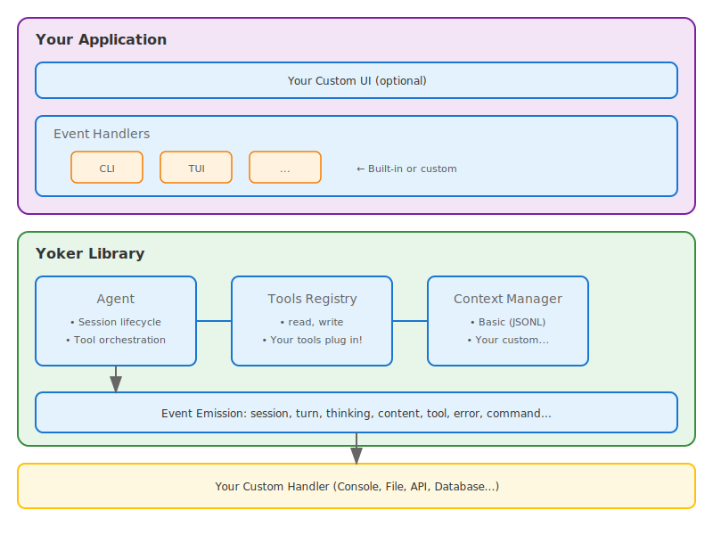

# Yoker

[](https://pypi.org/project/yoker/)
[](https://pypistats.org/packages/yoker)
[](https://pypi.org/project/yoker/)
[](https://github.com/christophevg/yoker/blob/master/LICENSE)
[](https://yoker.readthedocs.io/en/latest/?badge=latest)
[](https://github.com/christophevg/yoker/actions/workflows/tests.yml)
[](https://coveralls.io/github/christophevg/yoker)
[](https://docs.astral.sh/ruff/)

A Python agent harness with configurable tools, guardrails, and Ollama backend integration.

## Installation

```bash
pip install yoker
```

## Quick Start

```bash
python -m yoker
```

Or with an agent definition:

```bash
python -m yoker --agent examples/agents/researcher.md
```

Example session:



## Why Yoker?

Yoker fills a unique gap in the coding agent ecosystem: a **library-first, transparent agent harness** designed for developers who want full control, visibility, and simplicity.

**Key Differentiators:**
- **Library-first** - Embed in your applications, not locked into a CLI
- **LLM-neutral** - Choose your provider, your model, your cost model
- **No hidden manipulation** - All prompts visible, editable, configurable
- **Static permissions** - Deterministic boundaries, not runtime prompts
- **Full transparency** - Event-driven, everything inspectable

See [docs/rationale.md](docs/rationale.md) for the full rationale and comparison with other solutions.

## Features

**Current Features:**
- [x] Chat loop - Interactive conversation with Ollama
- [x] Tool calling - Structured tool execution with parameters
- [x] Slash commands - Built-in commands: `/help`, `/think on|off`
- [x] Thinking mode - LLM reasoning trace with gray output
- [x] Streaming - Real-time token streaming from Ollama
- [x] Configuration - TOML-based configuration system
- [x] Agent definitions - Load agents from Markdown files with YAML frontmatter
- [x] Multiline input - `Esc+Enter` for newlines, `Enter` to submit
- [x] Rich output - Styled terminal output with Rich
- [x] Event-driven architecture - Library-first design with event emission
- [x] Context persistence - Session resumption with JSONL storage
- [x] Event logging - Full session replay capability

**Planned Features:**
- [ ] Additional tools (list, write, update, search)
- [ ] Guardrails - Tool parameter validation
- [ ] Permissions - Static TOML-based access control
- [ ] Sub-agents - Hierarchical agent spawning with isolated context
- [ ] Multi-agent orchestration - Run coordinated agent teams
- [ ] Backend providers - OpenAI, Anthropic, custom backends
- [ ] Tool timing metrics - Performance tracking
- [ ] Token usage tracking - Cost monitoring
- [ ] Tool result caching - Reduce redundant calls
- [ ] Parallel tool execution - Concurrent read operations

### Interactive Input

The interactive session supports:

- **Multiline input**: Press `Esc+Enter` to add newlines, `Enter` to submit
- **Command history**: Up/Down arrows navigate previous messages
- **History search**: `Ctrl+R` to search through history
- **Keyboard navigation**: Arrow keys, Ctrl+A/E for cursor positioning
- **Text selection**: Click and drag to select output, copy with Ctrl+Shift+C or Cmd+C

### Slash Commands

| Command | Description |
|---------|-------------|
| `/help` | Show available commands |
| `/think on\|off` | Enable/disable LLM thinking trace |

### Thinking Mode

When thinking is enabled, the LLM shows its reasoning process:

```
[Thinking]
Let me analyze this step by step...
First, I need to understand the file structure...

[Response]
Based on my analysis, here's what I found...
```

### Demo Session Script

Generate terminal screenshots for documentation from Markdown script files:

```bash
# Run default demo script (demos/session.md)
python scripts/demo_session.py

# Run a specific demo script
python scripts/demo_session.py --script demos/list-tool.md

# Run all demo scripts in a directory
python scripts/demo_session.py --scripts-dir demos/

# Real LLM + log conversation for replay
python scripts/demo_session.py --script demos/session.md --log

# Replay from log (no LLM calls)
python scripts/demo_session.py --script demos/session.md --replay

# With an agent definition
python scripts/demo_session.py --script demos/session.md --agent examples/agents/markdown.md
```

## Configuration

Create a `yoker.toml` file to configure Yoker:

```toml
[harness]
name = "my-yoke"
log_level = "INFO"

[backend]
provider = "ollama"

[backend.ollama]
base_url = "http://localhost:11434"
model = "llama3.2:latest"

[tools.read]
enabled = true
allowed_extensions = [".txt", ".md", ".py"]
```

See `examples/yoker.toml` for the full configuration reference.

## Architecture

Yoker uses an **event-driven architecture** for library-first design. The Agent emits events; application code handles UI.



**Event Types**: Session (start/end), Turn (start/end), Thinking (start/chunk/end), Content (start/chunk/end), Tool (call/result), Error, Command

## Documentation

- [Full documentation](https://yoker.readthedocs.io/)
- [Installation guide](https://yoker.readthedocs.io/en/latest/installation.html)
- [Quick start](https://yoker.readthedocs.io/en/latest/quickstart.html)
- [Why Yoker?](docs/rationale.md) - Project rationale and comparison
- [Architecture](https://github.com/christophevg/yoker/blob/master/analysis/architecture.md)

## Development

```bash
git clone https://github.com/christophevg/yoker.git
cd yoker
pip install -e ".[dev]"

make test     # Run tests with coverage
make check    # Type checking + linting
make docs     # Build documentation
```

Requires Python 3.10+. See [CLAUDE.md](CLAUDE.md) for project conventions.

## Contributing

Contributions welcome! Please read [CLAUDE.md](CLAUDE.md) for project conventions and development guidelines.

## Changelog

See [GitHub Releases](https://github.com/christophevg/yoker/releases) for version history.

## License

MIT License - see [LICENSE](LICENSE) for details.

---

**Name**: "yoker" - One who yokes. The agent noun from "yoke" (PIE *yeug-* meaning "to join"). Pairs with "clitic" (both are joining tools). See [docs/NAME.md](docs/NAME.md) for full etymology.