# Getting Started with Ollama

This guide takes you from zero to a working Ollama account, a signed-in local
app/proxy, and (if you choose that path) an API key, so you can run yoker
against Ollama's free tier.

> **Note:** Screenshots below show the Ollama account-creation and sign-in
> flow. Your actual screens may differ slightly as Ollama updates its UI.

yoker connects to Ollama as its model provider. Ollama offers a free tier you
can use to explore yoker and agentic workflows at no cost. You can connect in
two ways:

- **The Ollama app running locally** (recommended — no API key needed), or
- **An Ollama API key** (use the cloud-hosted models without running the app).

You only need one of the two paths. Pick whichever fits; the yoker bootstrap
wizard asks you which one you want.

---

## Create an Ollama account

(account)=

If you don't yet have an Ollama account, create one now. The account lets you
sign in to the local app/proxy so cloud models work, and lets you generate an
API key if you choose that path.

1. Open [https://signin.ollama.com/sign-up](https://signin.ollama.com/sign-up) in your browser.
2. Click **Sign up** (top right).
3. Enter your email address and choose a password, or sign up with a
   third-party provider.
4. Confirm your email via the verification link sent to your inbox.
5. Once signed in, you'll land on your account dashboard.

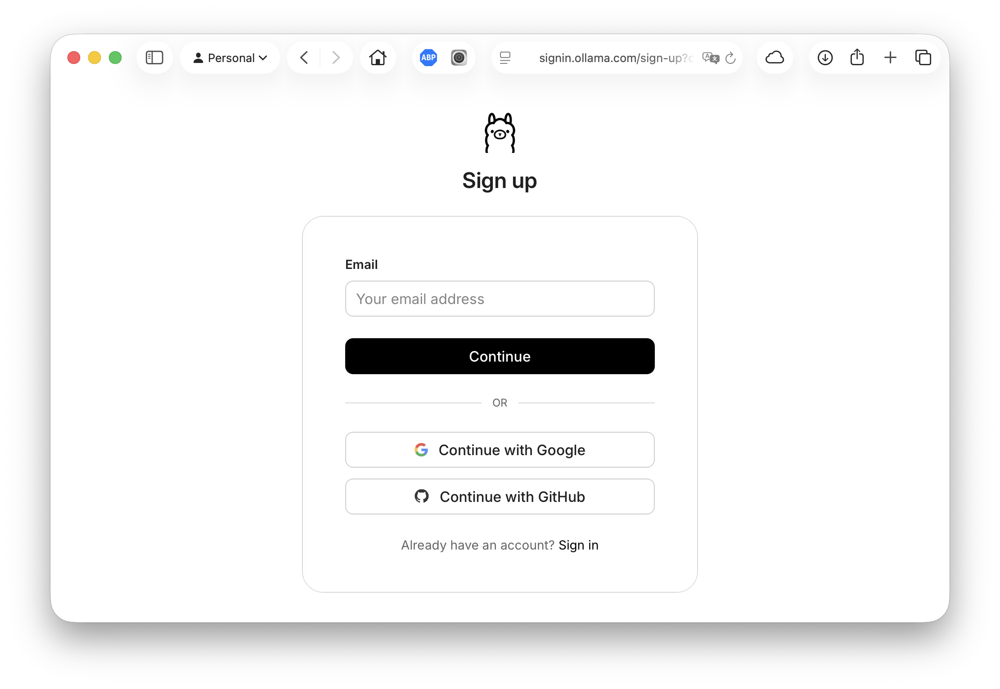
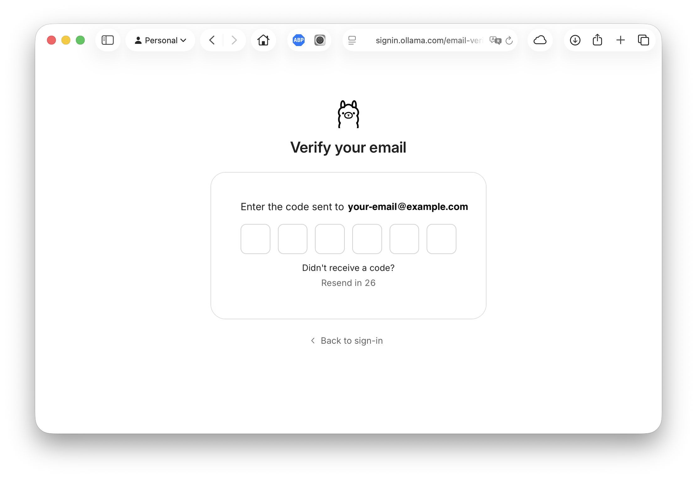
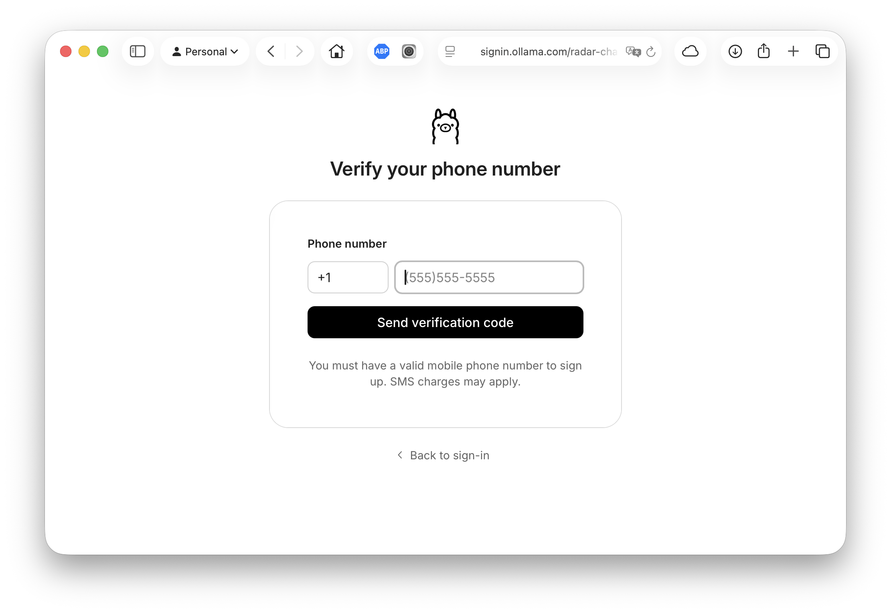
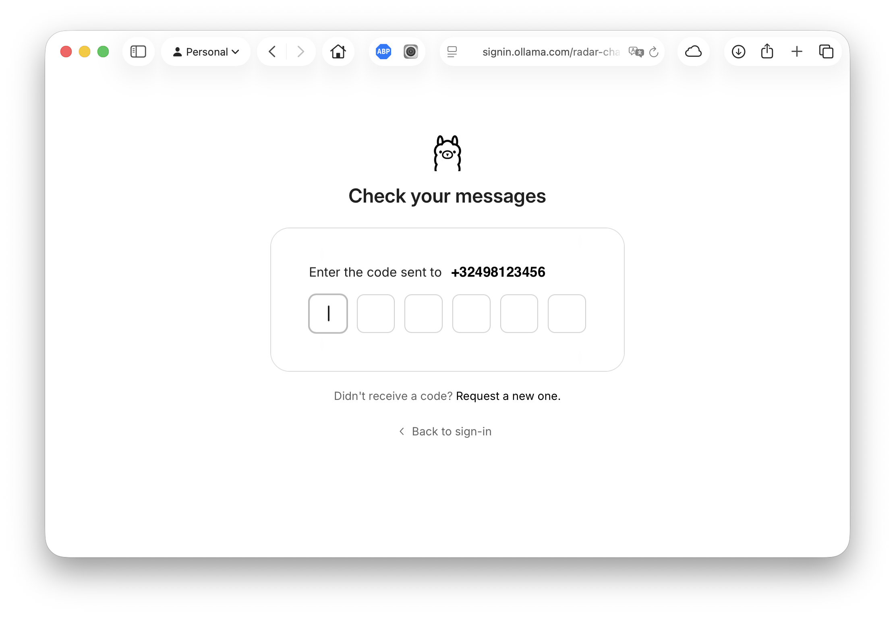
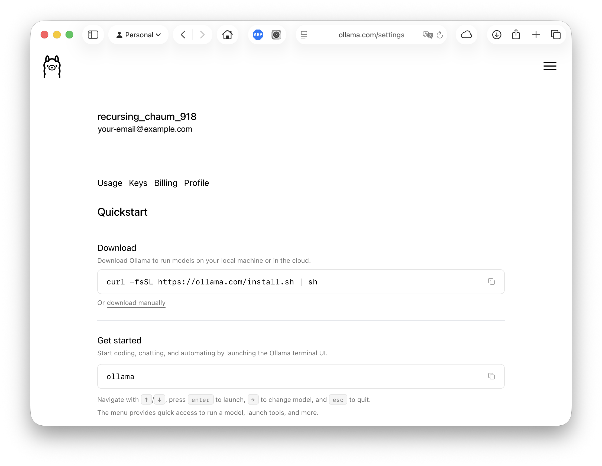
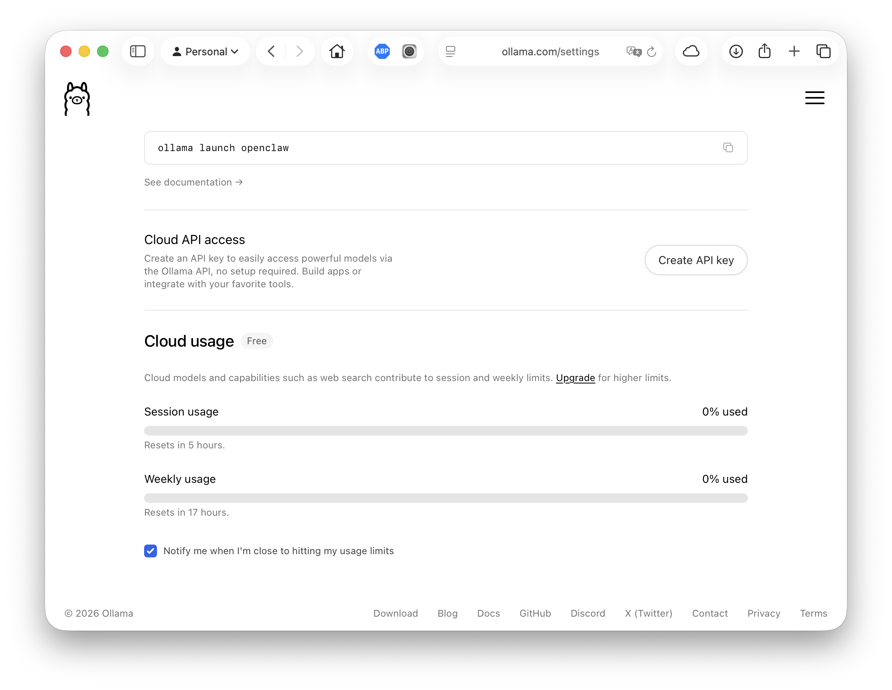

You now have an Ollama account. The next step is to install the local app/proxy
so cloud models work on your machine.

---

## Install the Ollama app/proxy

The Ollama app is a small local service that runs and proxies models. Signing in
to the app with your account is what unlocks cloud models from yoker's free
tier, so install it even if you later connect via an API key.

Choose your operating system:

### macOS

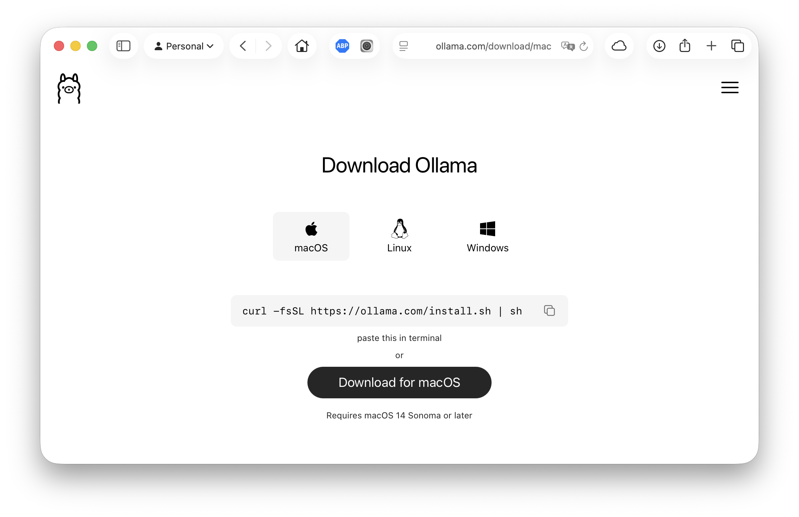

1. Download the macOS build from <https://ollama.com/download/mac>.
2. Unzip and drag **Ollama.app** to your **Applications** folder.
3. Launch **Ollama.app**. A menu-bar icon appears.

   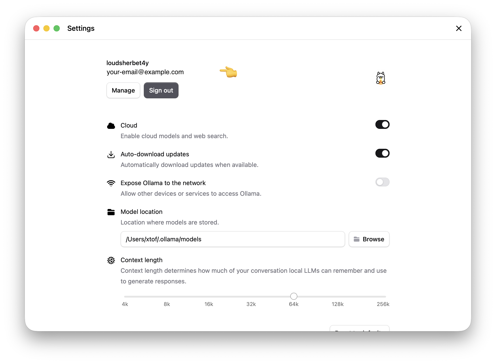

4. Sign in with the Ollama account you created above (see [Verify cloud-model
   access](#verify-cloud-model-access) below).

Alternatively, with Homebrew:

```bash
brew install ollama
```

Ollama operates as a client-server architecture. You can manage the background service easily using Homebrew services: 

* Start the server automatically in the background:
```bash
brew services start ollama
```
* Stop the background service:
```bash
brew services stop ollama
```
* Alternatively, if you only want to run the server on-demand for a single session without it running in the background, simply run
```bash
ollama serve
```

### Linux

1. Run the install script:

   ```bash
   curl -fsSL https://ollama.com/install.sh | sh
   ```

2. Start the service (the installer usually registers and starts it for you):

   ```bash
   sudo systemctl start ollama
   ```

3. Sign in with the Ollama account you created above (see [Verify cloud-model
   access](#verify-cloud-model-access) below).

### Windows

1. Download the Windows installer from <https://ollama.com/download/windows>.
2. Run the installer and follow the prompts.
3. Launch **Ollama** from the Start menu.
4. Sign in with the Ollama account you created above (see [Verify cloud-model
   access](#verify-cloud-model-access) below).

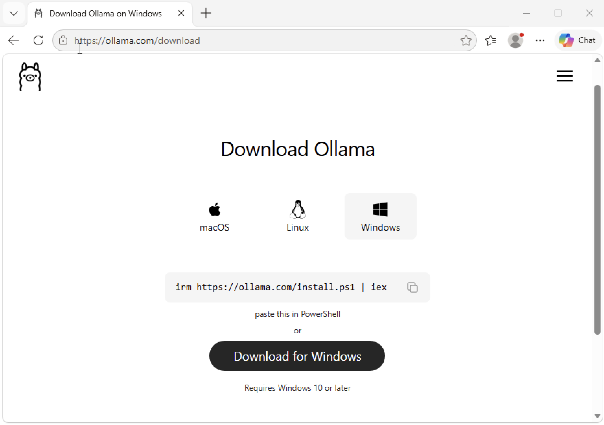

---

## Verify cloud-model access

Once the app/proxy is installed and running, sign in so that cloud models
(those reachable from yoker's free tier) work end-to-end.

1. Open the Ollama app (menu-bar icon on macOS, system tray on Windows, or the
   `ollama` CLI on Linux).
2. Choose **Sign in** (or **Settings → Sign in**).
3. Enter the credentials for the account you created in
   [Create an Ollama account](#account).
4. After a successful sign-in, the app shows your account email and a
   "Signed in" status.

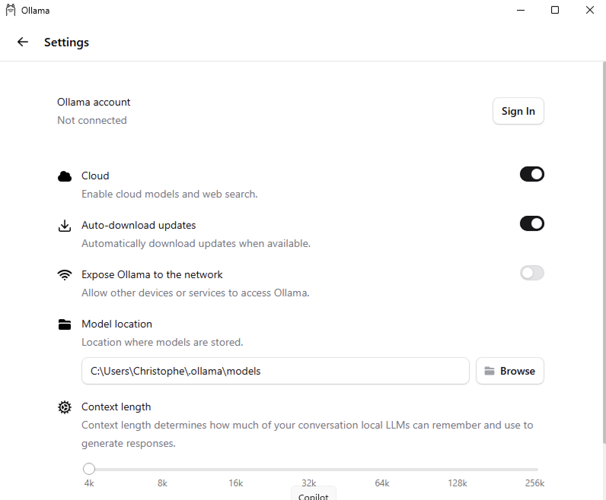
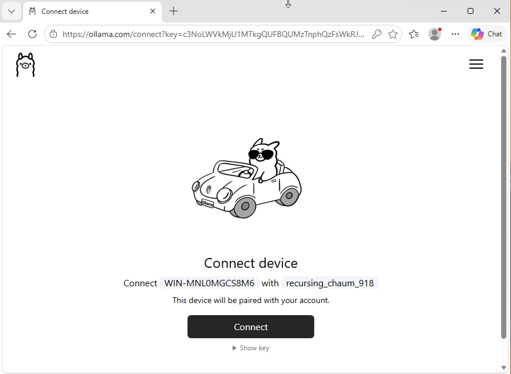
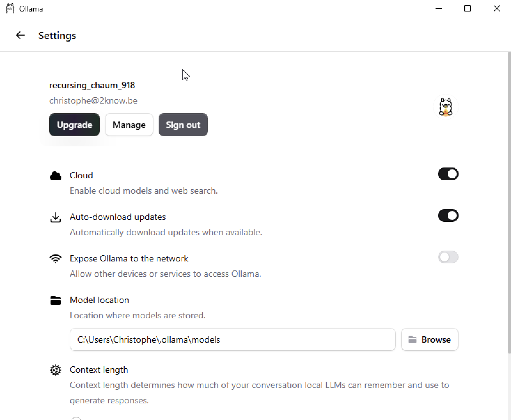

To confirm cloud models are reachable, pull a small model and run it:

```bash
ollama pull gemma3:1b
ollama run gemma3:1b "Say hello in one sentence."
```

If a response comes back, the local app is working and your account is signed
in. You can now connect yoker via the app (no key needed) — choose option 1 in
the bootstrap wizard's connection step.

If you'd rather use an API key instead of the local app, continue to the next
section.

---

## Generate an Ollama API key

(api-key)=

If you prefer to connect yoker to Ollama's cloud-hosted models without running
the local app, generate an API key from your account.

1. Sign in to <https://ollama.com> with your account.
2. Open your account settings — click your avatar (top right) and choose
   **Settings** (or **API Keys**, depending on the current layout).
3. Navigate to the **API Keys** section.
4. Click **Create new key** (or **New API key**).
5. Give the key a name, e.g. `yoker`.
6. Copy the generated key immediately — it is shown only once.

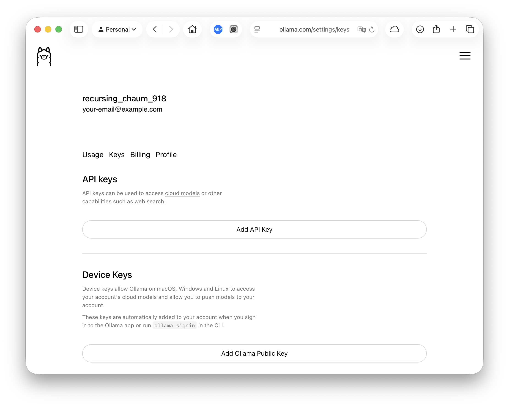

Treat the key like a password: store it in a secret manager, never commit it to
source control, and rotate it if it leaks.

Paste the key into the yoker bootstrap wizard when it prompts for it (Step 4,
option 2), or set it in your config:

```toml
[backend.ollama]
api_key = "ollama-..."
```

---

## Next steps

- Return to the yoker bootstrap wizard and continue past the connection step.
- Pick a model from the curated list (Step 5), or accept the default.
- For an overview of yoker, see the {doc}`quickstart <../quickstart>`.
