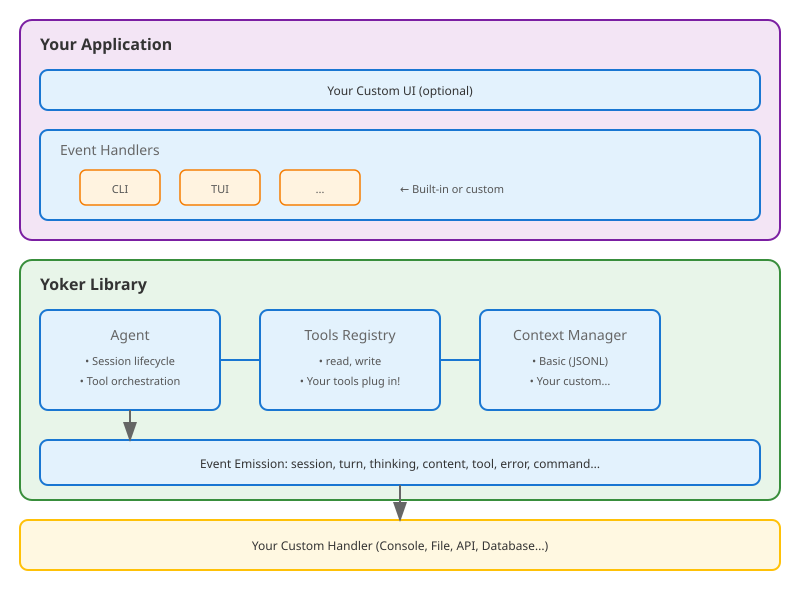

# Yoker Documentation

A Python agent harness with configurable tools, guardrails, and multi-provider LLM backend integration.

## Why Yoker?

Yoker is a **library-first, transparent agent harness** designed for developers who want full control, visibility, and simplicity.

**Key Differentiators:**
- **Library-first design** - Embed in your applications, not locked into a CLI
- **LLM-neutral** - Choose your provider, model, and cost model
- **No hidden manipulation** - All prompts visible, editable, configurable
- **Static permissions** - Deterministic boundaries, not runtime prompts
- **Full transparency** - Event-driven, everything inspectable

See [Why Yoker?](rationale.md) for the full rationale and comparison with other solutions.

## Quick Start

```bash
pip install yoker
python -m yoker
```

## Example Session

```{image} _static/session.svg
:alt: Yoker Session Example
:width: 100%
```

## Overview

**yoker** - One who yokes. The harness coordinates agents with structured tool access.

```{toctree}
:maxdepth: 2
:caption: Contents

installation
quickstart
cli
guides/getting-started
guides/getting-started-with-yoker
guides/getting-started-with-ollama
guides/getting-started-with-gemini
guides/creating-agentic-packages
models
plugins
rationale
NAME
api/index
```

## Current Features

- [x] CLI subcommands - `chat`, `run`, `loop`, `inspect`, `init`, `config`, `container`
- [x] Agentic packages - Run sources (module, GitHub, folder, zip) via `yoker run` with `agent.toml` manifest
- [x] Chat loop - Interactive conversation with any configured provider
- [x] Multi-provider backends - Ollama (native SDK), OpenAI, Anthropic, Google Gemini, and 100+ providers via LiteLLM
- [x] Bootstrap wizard - Interactive first-run setup that writes `~/.yoker.toml` for you
- [x] Tool calling - Structured tool execution with parameters
- [x] `read` tool - Read file contents with guardrails
- [x] `list` tool - Directory listing with pattern filtering
- [x] `write` tool - Write files with overwrite protection
- [x] `update` tool - Edit files with replace, insert, and delete operations
- [x] `search` tool - Search file contents with regex or filenames with glob
- [x] `existence` tool - Check if files or folders exist
- [x] `mkdir` tool - Create directories with depth limits
- [x] `git` tool - Git operations (status, log, diff, branch, show, add, commit, push, pull, tag, checkout, rm) with permission-controlled write operations
- [x] `github` tool - Read-only GitHub operations via `gh` CLI (issues, PRs, workflows, reviews, comments)
- [x] `make` tool - Execute Makefile targets with per-target env var allowlist and timeout enforcement
- [x] `websearch` tool - Web search with SSRF protection, domain filtering, and rate limiting
- [x] `webfetch` tool - Fetch web content with SSRF protection, URL validation, and size limits
- [x] `sleep` tool - Pause execution (1–300s) for polling intervals
- [x] `agent` tool - Spawn subagents with isolated context and recursion limits
- [x] `skill` tool - Invoke skills dynamically by name with full content loading
- [x] Slash commands - `/help`, `/think on|off|silent`, `/skills`, `/context`, `/tools`, `/agents`
- [x] Thinking mode - LLM reasoning trace (on/off/silent)
- [x] Streaming - Real-time token streaming from any provider
- [x] Configuration - TOML-based configuration via Clevis
- [x] Agent definitions - Load agents from Markdown files with YAML frontmatter
- [x] Package plugins - Load tools, skills, and agents from Python packages with `--with`
- [x] Multiline input - `Esc+Enter` for newlines
- [x] Rich output - Styled terminal output
- [x] Event-driven architecture - Library-first design
- [x] Context persistence - Session resumption with JSONL storage
- [x] Event logging - Full session replay capability
- [x] Demo scripts - Generate documentation screenshots from Markdown scripts
- [x] Schema-driven guardrails - `Path`, `Url`, `Query`, `Text` markers
- [x] Protected files - SOFT guardrail blocking agent `write`/`update` to a configurable denylist (`Makefile`, `pyproject.toml`, `yoker.toml`, `uv.lock`, `.git/config`, `.github/workflows/*.yml`, ...) with interactive approve-on-diff in `yoker chat` and a simple block in batch/`yoker run`; empty tuple opts out
- [x] Secure API key handling - Masked input, `chmod 600` config files
- [x] Session persistence - Resume hint on shutdown, `--resume` flag for continuing conversations
- [x] AGENTS.md context injection - Project-specific instructions auto-loaded into system prompt
- [x] Dict-based agent/skill directories - Namespace-aware directory configuration

## Architecture

Yoker uses an **event-driven architecture** for library-first design. The
Agent emits events; the UI layer receives them through `UIBridge` and decides
how to present them.



**Agent layer** (`yoker.core`): Configuration, context management, tool
execution, and event emission. No terminal or presentation logic.

**Backend layer** (`yoker.backends`): Provider-neutral streaming chat
backend. `OllamaBackend` uses the native Ollama SDK; `LitellmBackend` unifies
OpenAI, Anthropic, Gemini, and 100+ LiteLLM-supported providers.

**UI layer** (`yoker.ui`): Implements the `UIHandler` protocol.
`InteractiveUIHandler` (Rich terminal UI) and `BatchUIHandler`
(stdin/stdout/stderr for pipelines).

**Session layer** (`yoker.session`): Owns a team of agents — registry,
spawning, backend sharing, event aggregation, and inter-agent messaging.

The full architecture definition is available in `analysis/architecture.md`
in the repository.

## Indices and Tables

- {ref}`genindex`
- {ref}`modindex`
- {ref}`search`