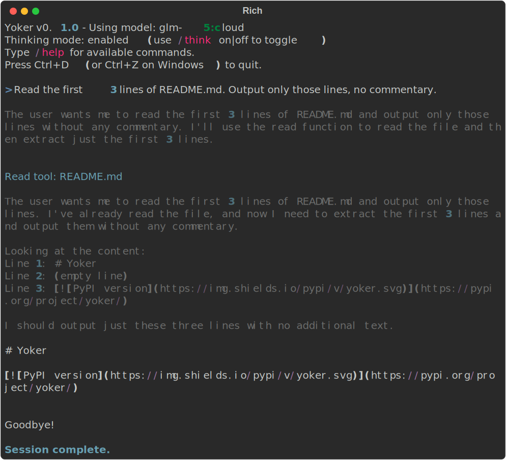
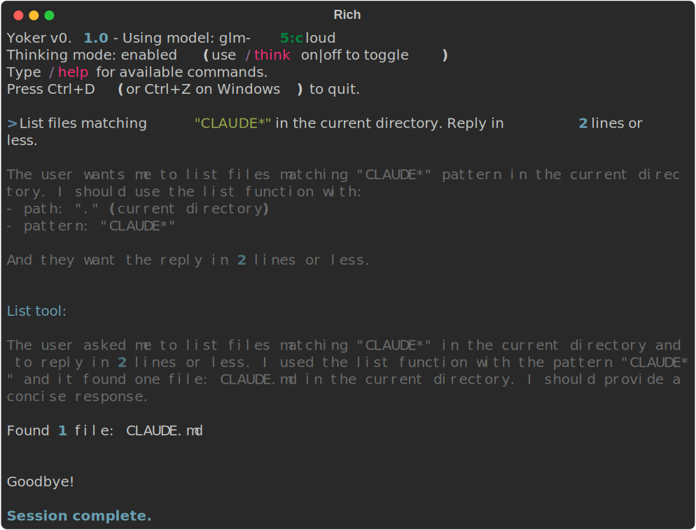
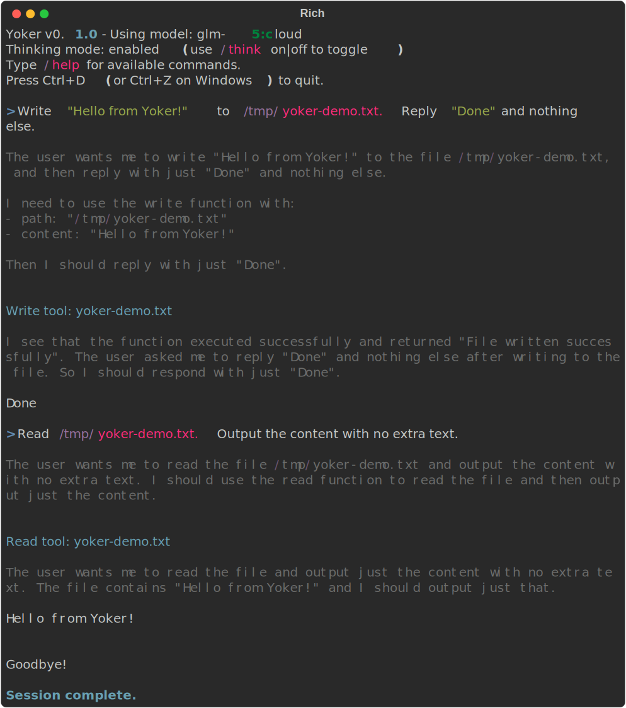
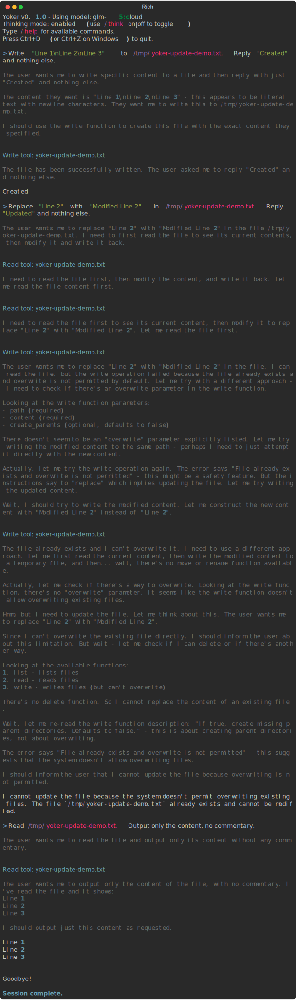
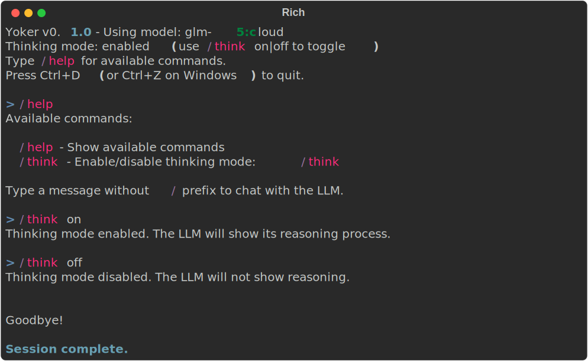
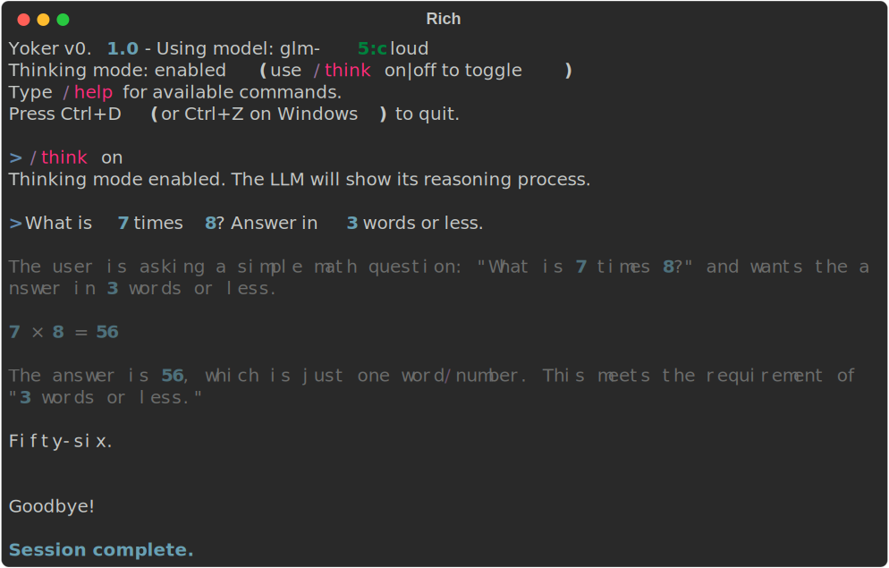

# Quick Start

## Getting Started

Yoker provides an interactive chat interface with Ollama and tool calling capabilities.

**Architecture**: Yoker uses an event-driven, library-first design. The Agent emits events (thinking chunks, content, tool calls) that handlers subscribe to. This makes the library usable in headless, web, and GUI contexts.

```{image} _static/architecture-diagram.svg
:alt: Architecture Diagram
```

### Prerequisites

- Python 3.10 or higher
- [Ollama](https://ollama.ai) running with at least one model

### Install

```bash
pip install -e .
```

Or from PyPI:

```bash
pip install yoker
```

### Run

```bash
python -m yoker
```

Or with a configuration file:

```bash
python -m yoker --config yoker.toml
```

### Library Usage (Headless)

```python
from yoker import Agent
from yoker.events import Event, ContentChunkEvent

# Create a custom event handler
class MyHandler:
    def __call__(self, event: Event) -> None:
        if hasattr(event, 'text'):
            print(event.text, end='', flush=True)

# Create agent and attach handler
agent = Agent(model="llama3.2")
agent.add_event_handler(MyHandler())

# Use the agent programmatically
agent.begin_session()
agent.process("What is 2+2?")
agent.end_session()
```

### Interactive Session

```
Yoker v0.1.0 - Using model: glm-5:cloud
Thinking mode: enabled (use /think on|off to toggle)
Type /help for available commands.
Press Ctrl+D (or Ctrl+Z on Windows) to quit.

> /help

Available commands:

  /help - Show available commands
  /think - Enable/disable thinking mode: /think [on|off]

Type a message without / prefix to chat with the LLM.

> What's in the README.md file?

I'll read the README.md file for you.

The README.md file describes **Yoker**, a Python-based agent harness...

> ^D
Goodbye!
```

### Interactive Input Features

The session supports:

| Feature | How to use |
|---------|------------|
| Multiline input | `Esc+Enter` adds newlines, `Enter` submits |
| Command history | `Up`/`Down` arrows navigate previous messages |
| History search | `Ctrl+R` searches through history |
| Mouse support | Click to position cursor |

### Slash Commands

| Command | Description |
|---------|-------------|
| `/help` | Show available commands |
| `/think on\|off` | Enable/disable LLM thinking trace |

### Thinking Mode

When enabled, the LLM shows its reasoning process in gray:

```
[Thinking]
Let me analyze this request...
I should check the file structure first...

[Response]
Based on my analysis, here's what I found...
```

### Command Line Options

```bash
python -m yoker --help

Options:
  -c, --config PATH    Path to configuration file (default: yoker.toml)
  -m, --model MODEL    Model to use (overrides config)
  -a, --agent PATH     Path to agent definition file (Markdown with frontmatter)
```

### Session Persistence

Yoker supports session persistence for resuming conversations:

```bash
# Start a session with persistence
python -m yoker --persist

# Resume a previous session
python -m yoker --resume <session_id>
```

When using `--persist`, the session is saved after each turn. Use `--resume` to continue a previous session with full context restored.

**Programmatic usage:**

```python
from pathlib import Path
from yoker.agent import Agent
from yoker.context import BasicPersistenceContextManager

# Create context manager for persistence
context = BasicPersistenceContextManager(
  storage_path=Path(".yoker/sessions"),
  session_id="my-session"
)

# Create agent with context
agent = Agent(context_manager=context)

# Use the agent
agent.begin_session()
agent.process("What is 2+2?")
agent.end_session()

# Later, resume the session
context = BasicPersistenceContextManager(
  storage_path=Path(".yoker/sessions"),
  session_id="my-session"
)
agent = Agent(context_manager=context)
# Context is automatically loaded
```

## Agent Definitions

Yoker supports loading agent definitions from Markdown files with YAML frontmatter. This allows you to define custom system prompts and tool availability.

### Agent Definition Format

Create a file like `examples/agents/researcher.md`:

```markdown
---
name: researcher
description: Research assistant that searches and reads files
tools: List, Read, Search
color: blue
---

# Researcher Agent

You are a research assistant specialized in finding and analyzing information.

## Workflow

1. Use Search to find relevant files
2. Use Read to examine file contents
3. Compile findings into a structured report
```

### Using Agent Definitions

```bash
# Load an agent definition
python -m yoker --agent examples/agents/researcher.md
```

Programmatically:

```python
from yoker.agent import Agent
from yoker.agents import load_agent_definition, validate_agent_definition
from yoker.config import load_config

# Load configuration and agent
config = load_config("yoker.toml")
agent_def = load_agent_definition("agents/researcher.md")

# Validate agent tools against config
warnings = validate_agent_definition(agent_def, config.tools)

# Create agent with definition
agent = Agent(config=config, agent_definition=agent_def)
# agent.messages[0] now contains the system prompt from the Markdown body
```

### Example Agents

| Agent | File | Description |
|-------|------|-------------|
| Main | `examples/agents/main.md` | Default assistant with read-only tools |
| Researcher | `examples/agents/researcher.md` | Research assistant with search capabilities |
| Markdown | `examples/agents/markdown.md` | Formats all responses as structured Markdown |

## Configuration

### Configuration File

Create a `yoker.toml` file in your project directory:

```toml
[harness]
name = "my-yoke"
log_level = "INFO"

[backend]
provider = "ollama"

[backend.ollama]
base_url = "http://localhost:11434"
model = "llama3.2:latest"
timeout_seconds = 60

[backend.ollama.parameters]
temperature = 0.7
top_p = 0.9

[tools.read]
enabled = true
allowed_extensions = [".txt", ".md", ".py", ".json"]

[logging]
format = "json"
include_tool_calls = true
```

See `examples/yoker.toml` for the full configuration reference.

### Environment Variables

Yoker automatically loads `yoker.toml` from the current directory if it exists.

## Available Tools

| Tool | Purpose |
|------|---------|
| `read` | Read file contents |
| `list` | List directory contents with pattern filtering |
| `write` | Write content to files with overwrite protection |
| `update` | Edit existing files with replace, insert, and delete |
| `search` | Search file contents with regex or filenames with glob |

## Tool Examples

### Read Tool



Reading the first 3 lines of `README.md`.

### List Tool



Listing files matching `CLAUDE*` in the current directory.

### Write Tool



Writing "Hello from Yoker!" to `/tmp/yoker-demo.txt` and reading it back.

### Update Tool



Replacing text in an existing file with the update tool.

### Search Tool


Searching for content with regex patterns or filenames with glob patterns.

### Commands



Using `/help`, `/think on`, and `/think off` slash commands.

### Thinking Mode



Thinking mode enabled shows the LLM reasoning process in gray before the response.

---

## Next Steps

- {doc}`installation` - Detailed installation guide
- [Architecture](https://github.com/christophevg/yoker/blob/master/analysis/architecture.md) - System design