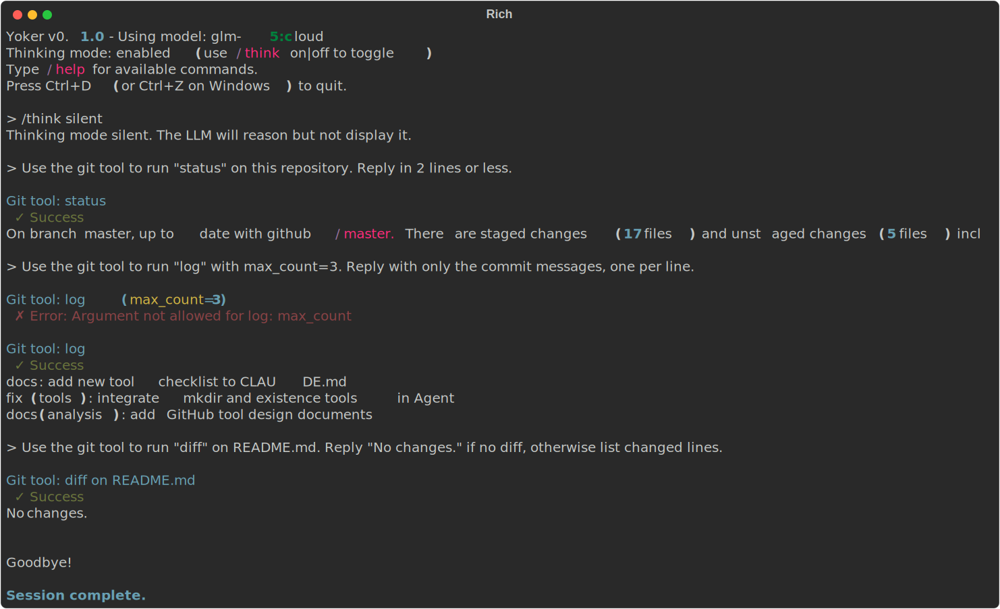

# Quick Start

## Getting Started

Yoker provides an interactive chat interface with Ollama and tool calling capabilities.

**Architecture**: Yoker uses an event-driven, library-first design. The Agent emits events
(thinking chunks, content, tool calls) that a `UIHandler` receives through a `UIBridge`.
This makes the library usable in headless, web, and GUI contexts without terminal logic
leaking into the agent.

```{image} _static/architecture-diagram.svg
:alt: Architecture Diagram
```

### Prerequisites

- Python 3.10 or higher
- [Ollama](https://ollama.ai) running with at least one model

### Install

```bash
pip install -e .
```

Or from PyPI:

```bash
pip install yoker
```

### Run

```bash
python -m yoker
```

Or with an agent definition:

```bash
python -m yoker --agents-definition examples/agents/researcher.md
```

### Library Usage (Headless)

Yoker is designed to be embedded as a library. The example below uses the built-in
`BatchUIHandler` and `UIBridge` to render agent events without the CLI.

```python
import asyncio

from yoker import Agent, __version__
from yoker.config import get_yoker_config
from yoker.ui import BatchUIHandler, UIBridge


async def main():
    # Load configuration from environment variables, ~/.yoker.toml,
    # ./yoker.toml, and built-in defaults.
    config = get_yoker_config(cli=False)

    # Create the agent. All heavy lifting (context, tools, guardrails)
    # is configured from the Config object.
    agent = Agent(config=config)

    # Create a UI handler and bridge agent events to it.
    ui = BatchUIHandler(show_thinking=True, show_tool_calls=True)
    bridge = UIBridge(ui)
    agent.add_event_handler(bridge)

    # Start the UI, process a message, then shut down.
    await ui.start(agent.model, __version__, {})
    try:
        await agent.process("What is 2+2?")
    finally:
        await ui.shutdown("complete")


asyncio.run(main())
```

For a fully custom integration, implement the `UIHandler` protocol (or extend
`BaseUIHandler`) and wire it through `UIBridge`. See `examples/custom_handler.py`
for a minimal custom handler.

### Async Model

Yoker is built with an async-first architecture:

- **All Agent methods are async**: `process()` is a coroutine.
- **UI handlers are async**: Input, lifecycle, and streaming methods use `await`.
- **Event handlers can be sync or async**: Handlers receive events in the same asyncio
task as `process()`.

```python
class DatabaseHandler:
    """Example async handler writing to a database."""

    def __init__(self, db_connection):
        self.db = db_connection

    async def __call__(self, event) -> None:
        if isinstance(event, TurnEndEvent):
            # Direct await - no run_coroutine_threadsafe needed!
            await self.db.save_response(event.response)


async def main():
    agent = Agent(model="llama3.2")
    agent.add_event_handler(DatabaseHandler(db))
    await agent.process("Hello")  # Handler runs in the same event loop
```

**Threading Model:**

| Context | Where handlers run |
|---------|---------------------|
| `await agent.process()` | Same asyncio task |
| Interactive CLI | Main asyncio event loop |
| Web server (FastAPI) | Request handler's event loop |

Handlers run synchronously within the asyncio event loop. For long-running operations,
use async handlers that yield control (for example, `await asyncio.sleep(0)`) or offload
to a separate executor.

### Interactive Session

```
Yoker v0.4.0 - Using model: llama3.2:latest
Type /help for available commands.
Press Ctrl+D (or Ctrl+Z on Windows) to quit.

> /help

Available commands:

  /help - Show available commands
  /think - Enable/disable thinking mode: /think [on|off]
  /skills - List available skills
  /context - Show current conversation context
  /tools - List all known tools with availability
  /agents - Show loaded agent and known agents

Type a message without / prefix to chat with the LLM.

> What's in the README.md file?

I'll read the README.md file for you.

The README.md file describes **Yoker**, a Python-based agent harness...

> ^D
Goodbye!
```

### Interactive Input Features

The session supports:

| Feature | How to use |
|---------|------------|
| Multiline input | `Esc+Enter` adds newlines, `Enter` submits |
| Command history | `Up`/`Down` arrows navigate previous messages |
| History search | `Ctrl+R` searches through history |
| Mouse support | Click to position cursor |

### Slash Commands

| Command | Description |
|---------|-------------|
| `/help` | Show available commands |
| `/think on\|off` | Enable/disable LLM thinking trace |
| `/skills` | List available skills |
| `/context` | Show current conversation context |
| `/tools` | List all known tools with availability |
| `/agents` | Show loaded agent and known agents |

Any command name that matches a loaded skill is treated as a skill invocation. For
example, if a skill named `example` is loaded, `/example` injects the skill content
into the conversation.

### Thinking Mode

When enabled, the LLM shows its reasoning process in gray:

```
[Thinking]
Let me analyze this request...
I should check the file structure first...

[Response]
Based on my analysis, here's what I found...
```

### Command Line Options

```bash
python -m yoker --help
```

Key options generated from the Clevis configuration schema:

| Flag | Description |
|------|-------------|
| `--backend-ollama-model MODEL` | Model to use (overrides config) |
| `--agents-definition PATH` | Path to agent definition file (Markdown with frontmatter) |
| `--ui-mode interactive\|batch` | Run in interactive or batch mode |
| `--ui-show-thinking` | Show thinking output |
| `--ui-show-tool-calls` | Show tool call information |
| `--ui-show-stats` | Show turn statistics |
| `--with PACKAGE` | Load a Python package plugin (repeatable) |

The `--with` argument is intercepted before Clevis parses the rest of the command line,
so it can be combined with any other option:

```bash
python -m yoker --with yoker_plugin_demo --agents-definition examples/agents/researcher.md
```

### Session Persistence

Yoker supports session persistence for resuming conversations. Configure it in
`yoker.toml`:

```toml
[context]
manager = "basic_persistence"
storage_path = "./context"
session_id = "auto"
persist_after_turn = true
```

When `persist_after_turn` is true, the session is saved after each turn. To resume a
specific session, set `session_id` to the previously generated id.

**Programmatic usage:**

```python
import asyncio
from pathlib import Path

from yoker import Agent
from yoker.config import get_yoker_config
from yoker.context import PersistenceContextManager


async def main():
    config = get_yoker_config(cli=False)

    # Create context manager for persistence
    context = PersistenceContextManager(
        storage_path=Path(".yoker/sessions"),
        session_id="my-session",
    )

    # Create agent with context
    agent = Agent(config=config, context_manager=context)

    # Use the agent (all methods are async)
    await agent.process("What is 2+2?")

    # Later, create another PersistenceContextManager with the same
    # session_id to load the previous conversation automatically.


asyncio.run(main())
```

## Tools

Yoker provides several tools for file operations, web access, and subagent spawning:

| Tool | Description |
|------|-------------|
| `read` | Read file contents with guardrails |
| `list` | Directory listing with pattern filtering |
| `write` | Write files with overwrite protection |
| `update` | Edit existing files with replace/insert/delete |
| `search` | Search file contents or filenames |
| `existence` | Check if files or folders exist |
| `mkdir` | Create directories with parent creation |
| `git` | Git operations with permission-controlled commit/push |
| `agent` | Spawn subagents with isolated context |
| `skill` | Invoke skills dynamically by name |
| `web_search` | Web search with SSRF protection and domain filtering |
| `web_fetch` | Fetch web content with SSRF protection and URL validation |

### Agent Tool

The `agent` tool allows spawning subagents for specialized tasks:

```{image} _static/demo-agent-tool.svg
:alt: Agent Tool Demo
```

```
> Use the agent tool to spawn a researcher agent to find all TODO comments

[Tool Call] agent(agent_path="examples/agents/researcher.md", prompt="Find all TODO comments")

The researcher agent found 15 TODO items across the codebase...
```

Key features:
- **Isolated context**: Subagents start with fresh context
- **Recursion limits**: Maximum depth of 3 by default
- **Timeout**: 5-minute default execution limit
- **Tool filtering**: Subagents use only their defined tools

### Skill Tool

The `skill` tool allows the agent to invoke skills dynamically by name:

```
> use the example skill

[Tool Call] skill(skill_name="example")
```

Key features:
- **Dynamic loading**: Skills are loaded from configured `skills.directories`
- **Full content**: Returns the complete skill content for the agent to follow
- **Args support**: Pass arguments to skills via the `args` parameter
- **Discovery**: Available skills shown in the system reminder

## Plugins

External Python packages can provide tools, skills, and agents through the plugin
system. A plugin declares its components with a `__YOKER_MANIFEST__` object in its
top-level package `__init__.py`.

Install the demo plugin and run Yoker with it:

```bash
uv pip install -e examples/plugins/demo
python -m yoker --with yoker_plugin_demo
```

Load multiple plugins by repeating `--with`:

```bash
python -m yoker --with yoker_plugin_demo --with pkgq
```

Inside the session, plugin skills are invoked by name:

```
> /greeting
```

See `examples/plugins/demo/README.md` for a complete plugin development guide.

## Agent Definitions

Yoker supports loading agent definitions from Markdown files with YAML frontmatter.
This allows you to define custom system prompts and tool availability.

### Agent Definition Format

Create a file like `examples/agents/researcher.md`:

```markdown
---
name: researcher
description: Research assistant that searches and reads files
tools: List, Read, Search
color: blue
---

# Researcher Agent

You are a research assistant specialized in finding and analyzing information.

## Workflow

1. Use Search to find relevant files
2. Use Read to examine file contents
3. Compile findings into a structured report
```

### Using Agent Definitions

```bash
# Load an agent definition
python -m yoker --agents-definition examples/agents/researcher.md
```

Programmatically:

```python
from yoker import Agent
from yoker.agents import load_agent_definition, validate_agent_definition
from yoker.config import get_yoker_config

# Load configuration and agent
config = get_yoker_config(cli=False)
agent_def = load_agent_definition("examples/agents/researcher.md")

# Validate agent tools against config
warnings = validate_agent_definition(agent_def, config.tools)

# Create agent with definition
agent = Agent(config=config, agent_definition=agent_def)
```

### Example Agents

| Agent | File | Description |
|-------|------|-------------|
| Main | `examples/agents/main.md` | Default assistant with read-only tools |
| Researcher | `examples/agents/researcher.md` | Research assistant with search capabilities |
| Markdown | `examples/agents/markdown.md` | Formats all responses as structured Markdown |

## Configuration

### Configuration File

Create a `yoker.toml` file in your project directory:

```toml
[harness]
name = "my-yoke"
log_level = "INFO"

[backend]
provider = "ollama"

[backend.ollama]
base_url = "http://localhost:11434"
model = "llama3.2:latest"
timeout_seconds = 60

[backend.ollama.parameters]
temperature = 0.7
top_p = 0.9

[agents]
definition = "./agents/researcher.md"  # Optional: agent definition file

[tools.read]
enabled = true
allowed_extensions = [".txt", ".md", ".py"]
```

See `examples/yoker.toml` for the full configuration reference.

### Environment Variables

Yoker auto-discovers configuration files in this order:

1. `./yoker.toml` (current directory)
2. `~/.yoker.toml` (user home directory)
3. Built-in defaults

You can also specify an explicit config file with Clevis:

```bash
python -m yoker --config path/to/config.toml
```

## Available Tools

| Tool | Purpose |
|------|---------|
| `read` | Read file contents |
| `list` | List directory contents with pattern filtering |
| `write` | Write content to files with overwrite protection |
| `update` | Edit existing files with replace, insert, and delete |
| `search` | Search file contents with regex or filenames with glob |
| `git` | Git operations (status, log, diff, branch, show) |

## Tool Examples

### Read Tool


Reading the first 3 lines of `README.md`.

### List Tool


Listing files matching `CLAUDE*` in the current directory.

### Write Tool


Writing "Hello from Yoker!" to `/tmp/yoker-demo.txt` and reading it back.

### Update Tool


Replacing text in an existing file with the update tool.

### Search Tool


Searching for content with regex patterns or filenames with glob patterns.

### Git Tool



Running Git operations (status, log, diff) on a repository.

### Commands


Using `/help`, `/think on`, and `/think off` slash commands.

### Thinking Mode


Thinking mode enabled shows the LLM reasoning process in gray before the response.

---

## Next Steps

- {doc}`installation` - Detailed installation guide
- [Architecture](https://github.com/christophevg/yoker/blob/master/analysis/architecture.md) - System design
